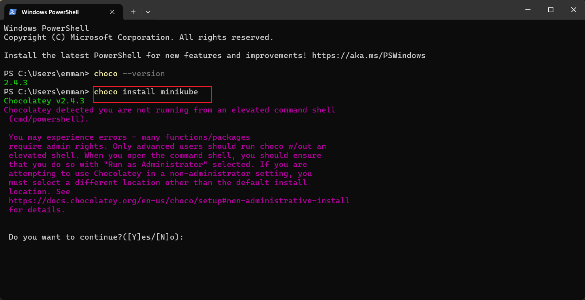
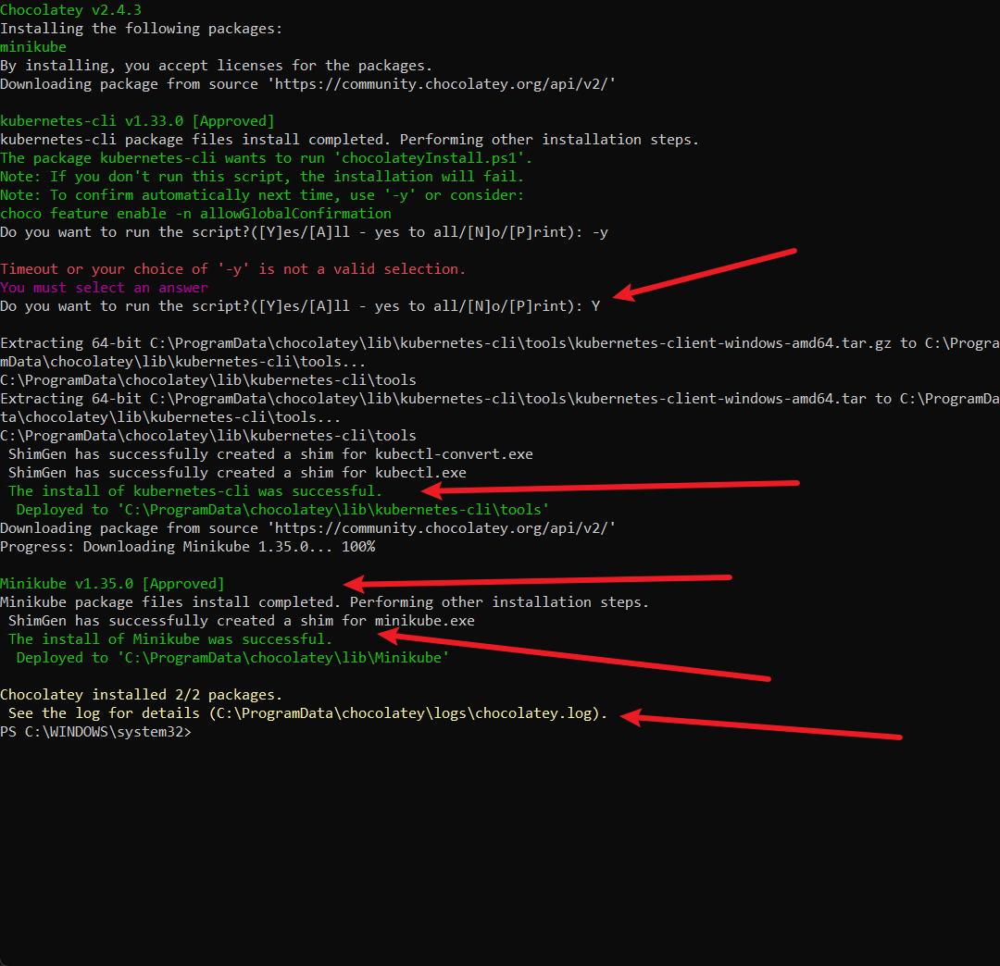
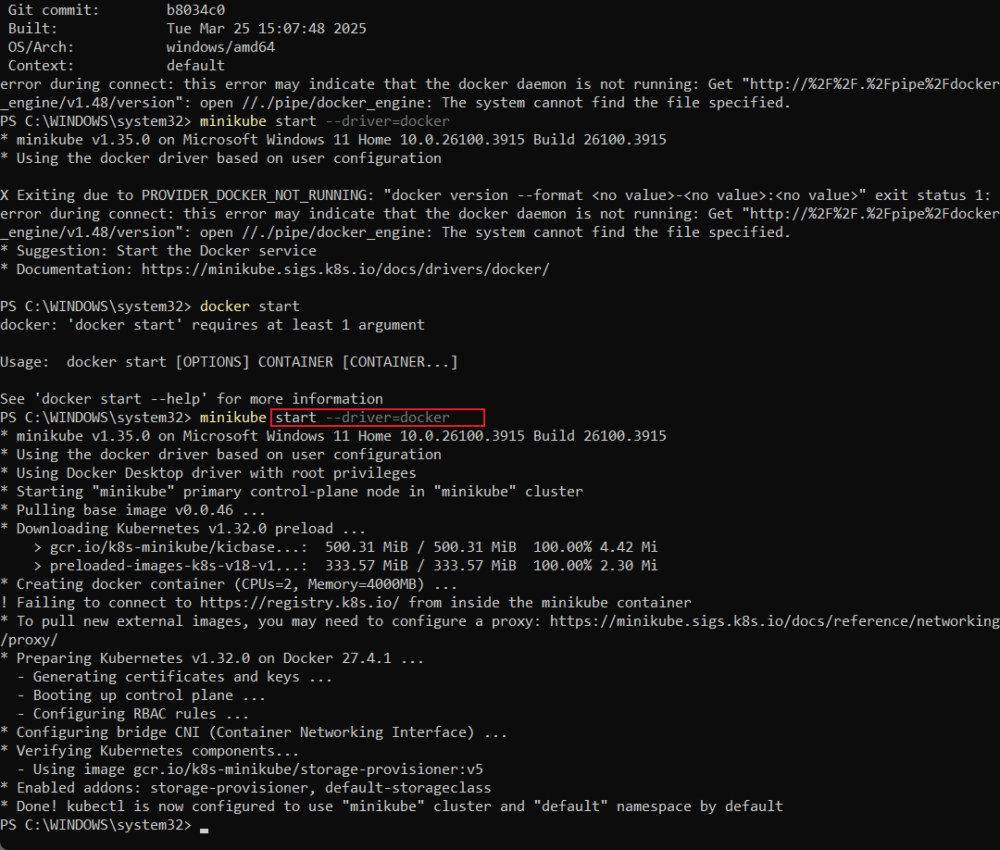
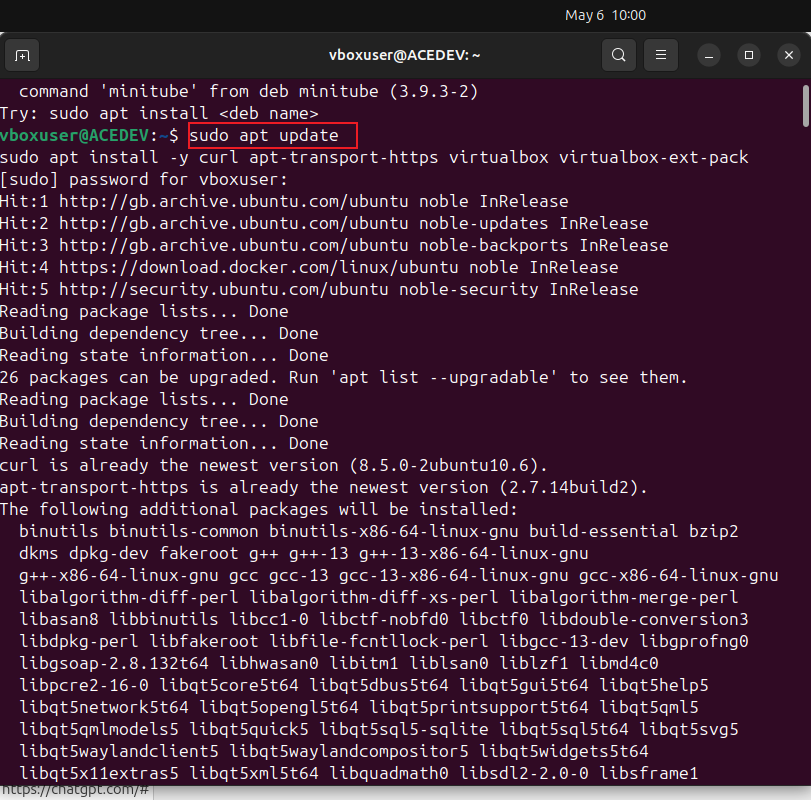
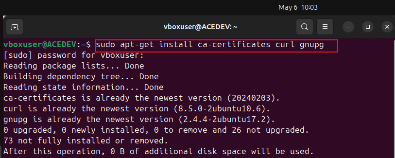
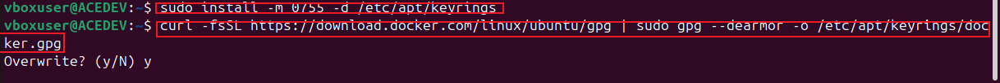
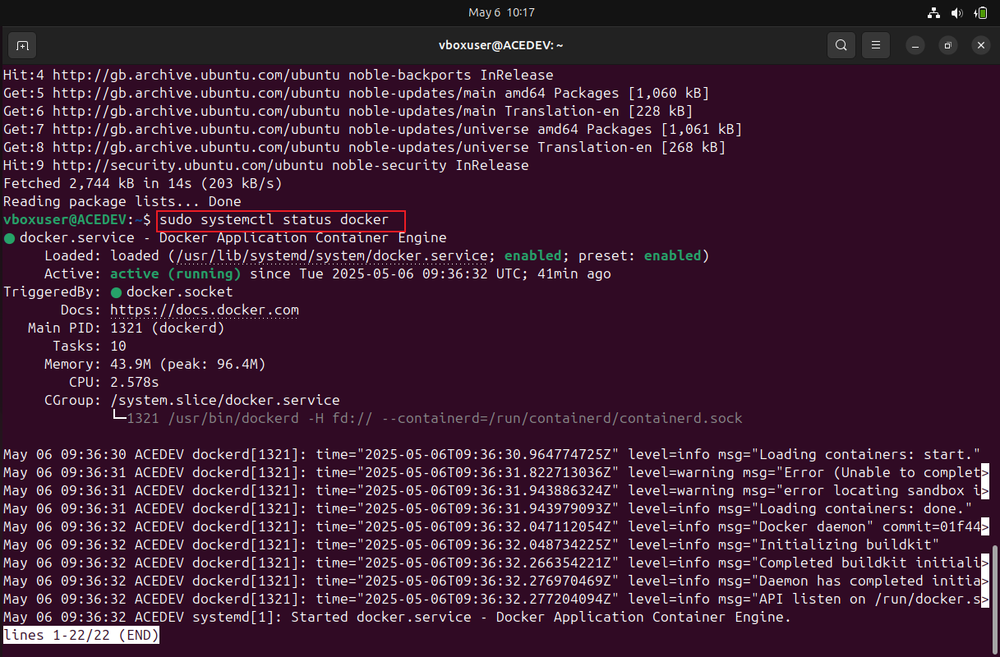
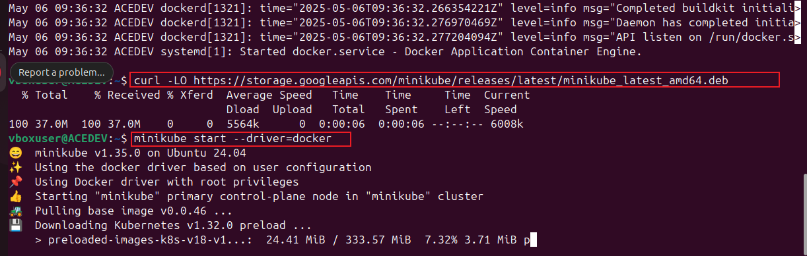
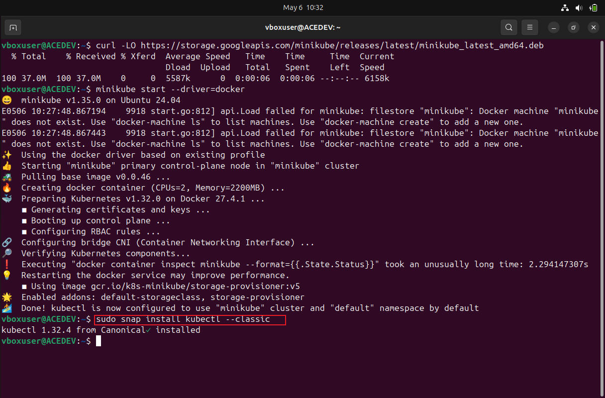

# setting-up-Minikube
container orchestration with kubernetes

Minikube
Minikube is an open-source tool that allows you to run Kubernetes clusters locally on your machine. Since Kubernetes is a powerful container orchestration platform, Minikube provides a lightweight way to experiment with Kubernetes without needing a full cloud-based setup. It creates a local Kubernetes environment, making it easier for developers to build, test, and deploy applications before moving them to production.

# STEP 1: Installing Minikubes on Windows
* Install chocolatey
first step was to make sure restriction to making changes in the policy was removed using the commands :
      
      choco install minikube

the minikube needs a docker as a driver and also to pull its base image there installation of docker is required:
     
     minikube start --driver=docker

# STEP 2: Installing  Minikubes on Linux:

* install docker as a driver for minikube to pull images for the kubernetes cluster

   sudo apt-get update

* Ensure latest software information is available for installation

   sudo apt-get install ca-certificates curl gnupg

    
    
* Install essential packages including certificate authorities for secure communication and package verfication, Download Docker GPG key using "curl":
     
     sudo install -m 0755 -d /etc/apt/keyrings

     curl -fsSL https://download.docker.com/linux/ubuntu/gpg | sudo gpg --dearmor -o /etc/apt/keyrings/docker.gpg

* Set permission for all users on the Docker GPG key filenwithin the APT keyring directory and Add the repository to Apt sources:

      sudo chmod a+r /etc/apt/keyrings/docker.gpg
      echo \
      "deb [arch=$(dpkg --print-architecture) signed-by=/etc/apt/keyrings/docker.gpg] https://download.docker.com/linux/ubuntu \
      $(. /etc/os-release && echo "$VERSION_CODENAME") stable" | \
      sudo tee /etc/apt/sources.list.d/docker.list > /dev/null

* Verify docker installation
     
      sudo systemctl status docker

* Installing minikube using "curl" and starting the minikube
     
     curl -LO https://storage.googleapis.com/minikube/releases/latest/minikube_latest_amd64.deb

     minikube start --driver=docker 

* Download the kubernetes command line (kubectl) tool to interact with kubernetes cluster:
        
      sudo snap install kubectl --classic

